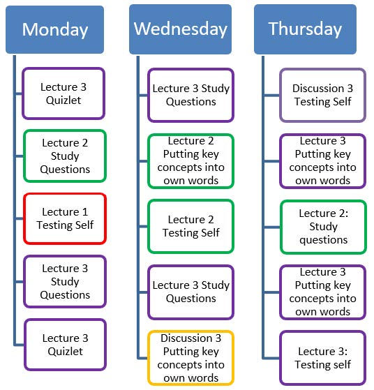
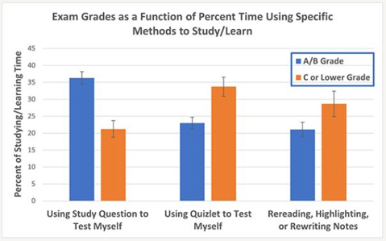

```{r setup, include = FALSE}
knitr::opts_chunk$set(echo = TRUE,
                      error = TRUE,
                      comment = "")
```

```{r, include = FALSE}
library("emo")
```

In this course, our goal is for you to learn about and understand the science of clinical psychology, its application to the real world, and the limitations and strengths of the clinically relevant research and claims you encounter.
We have created this document to describe evidence-based strategies for learning and applying the course material, as well as preparing for exams.

# Attend and Participate in Every Class Session

- <u>Attend every lecture and class discussion section.</u>
Attendance is important for learning the material.
Get notes if you miss a class.
- <u>Take good notes</u> in every lecture and discussion section, and while doing the readings.
We purposefully leave blanks in our Powerpoint slides that necessitate notetaking.
Taking notes will facilitate active learning AND be useful when preparing for exams.
Don't try to copy down verbatim what the instructor or TA is saying.
Rather, think about the new concepts they are introducing and find ways to summarize the new information in ways that will make sense to you later along the way.
Review your notes carefully, and let your TA or Professor Petersen know if you have any questions or points of confusions!
- <u>Participate fully in active-learning opportunities in lectures and discussion sections</u>.
We will try to provide opportunities in every class session to discuss ideas with your neighbors, to write about your perspectives, and to answer questions or solve problems on the Powerpoint slides.
- <u>Ask questions</u> in class (we'll address as many as we can!).
And ask questions outside of class.
You can do this right after class or discussion section.
You can come to office hours with any of the TAs or with Professor Petersen.
You can email questions to any of the TAs or Professor Petersen.
You can also ask other students in the class or in your study group about your questions.
We know that it can be anxiety-provoking to talk with your TAs or course instructors, but we all love talking with students, and we're really good at figuring out what is confusing you and then helping you to understand it better!

# Do All of the Required Readings and Assignments

Completion of the required readings and assignments is an important prerequisite for learning the material.

# Pay Particular Attention to What is Most Important

There is too much content in the class to remember everything, so it is important to prioritize studying the most important information.

<u>Pay close attention to things that are emphasized, including things that are talked about more than once.</u>
Certain concepts will be emphasized much more than others.
If we discuss something several times or with greater emphasis, it is because it is a critical concept and we want to make sure you understand it.
Listen for themes that come up in both lecture and discussions sections.
Make sure you understand what is important about them!

<u>Pay particular to the take-away messages of each lecture, discussion section, and reading.</u>
When you read an article or review a lecture, ask yourself: "What are the main messages Professor Petersen wants us to hear?"
After attending lecture and the discussion sections, close your notes and ask yourself, "What were the main points that Professor Petersen or the TA emphasized and what was important about them?"
Similarly, after reading the assignment for discussion sections or lecture, turn the material face down and ask yourself, "What was important about this reading?
What about this is relevant to lecture and section? What are the main things to learn?"
If you read a research article, ask yourself "What are the main findings?
What are the strengths and limitations of the study?"
**Have the reading quiz open while reading the article**, to help guide your reading so you make sure you take away the key points of the reading.

<u>Pay attention to the examples Professor Petersen and the TAs use in lecture and section.</u>
Examples will help place the different concepts into context.
Think about the different examples given in class and use them to learn how each concept can be applied.
This should give you a better understanding of what might otherwise be an abstract concept.

<u>Focus on understanding the concepts</u>, not just memorizing the details.
Students are often taught to memorize facts to be successful in class.
Although memorizing some facts will be helpful in this class, we really want you to understand how the facts are *applied* in clinical psychology.
Thus, many test questions will require that you both know the facts and understand more abstract concepts.
To succeed in this class, it is important that you think deeply about and learn to apply the knowledge from lecture and section, rather than simply memorizing it.
You will do best on exams if you go beyond memorizing and critically think about the ideas we present in lecture and discussion sections.
In addition to understanding the concepts and technical terms we have discussed, you should understand why they are important and how to apply them.
Compare concepts discussed in class and think about how they are similar or different.
Apply concepts to real world scenarios and think through the examples presented in class.
Put the concepts into your own words and try to teach them to someone else.
This helps you figure out what you do and don't understand, which puts you in a better position to ask specific questions after class or in office hours.

Regarding the types of questions you may be asked on the exam, you do *not* need to memorize dates, names, or exact numbers, unless the date/name/number was stressed in class or section, but you will be expected to know general trends that we emphasized.

# Use Effective Study Strategies

## Schedule Study Time

<u>Do not leave things for last minute.</u>
You will have a lot to study before you know it.
Try to keep up with the material and ask questions if you have them.

<u>Study for shorter but more frequent periods.</u>
One of the **BEST** things you can do to learn the course material is <u>**study for a shorter amount of time, on multiple days a week, and for every week of the semester**</u>.
Research clearly indicates that this is a much more effective approach than cramming your studying into two or three longer study sessions right before the exam.
In a nutshell, the research on studying tells us that humans best remember information when they practice recalling that information across numerous study sessions.

For instance, if you budget one hour to learn all the different types of reliability and validity, you will be more likely to remember them on test day if you study them for 15 minutes across four days rather than studying them for a single hour at one time.
Thus, even though you’re not studying the information for any longer, spreading out the times that you study (i.e., revisiting the material again and again for briefer study sessions) is the best approach to successfully remembering the information on test day and beyond the course itself.

We recommend studying the course material for 4–5 hours per week across three 90-minute study sessions or across four-to-five 60-minute study sessions.
We suggest scheduling these study sessions in your calendar to occur every week just like you would your classes.
Here is an example of what your study session schedule might look like:

| Monday    | Tuesday | Wednesday  | Thursday  | Friday |
|:----------|:--------|:-----------|:----------|:-------|
| 8:00–9:30 |         | 11:30–1:00 | 5:30–7:00 |        |

Now that you have scheduled regular study sessions, what is the most effective way to design your study strategy within each session?
Research indicates that <u>the most effective study strategy spreads out testing yourself on different parts of the material **within** study sessions as well as **between** study sessions</u>.
For instance, if you want to remember the inclusion and exclusion criteria for mental disorders, you might test yourself on what you remember, check your answers, and then move on to study something else.
Then, at the end of the same study session, you could test yourself again on inclusion and exclusion criteria and check your answers.
You could also decide to test yourself on these criteria at the start of each study session for a week, until remembering the information becomes easy and you can recall it automatically.
This helps your brain practice successful remembering.
If something is difficult to remember, try struggling with it before you show yourself the answer.
Memory works sort of like a muscle, so challenging your brain to remember something difficult can help you remember more successfully the next time.

Below, <u>we've included an example week of how individual study sessions might be structured using the spaced-out approach</u> during a week early in the semester, when you have had the first three lectures and have already spent some time studying the first two lectures.
Keep in mind that the third lecture has more material than the first two lectures and is the most recently learned (so the least studied).
Thus, it is allotted the most time.
Imagine spending 15–20 minutes on each block within a session.
Customize these study sessions to spend the most time on course material that feels the most challenging to you and less time on material that you feel more confident about.
<u>As you can see, the lectures repeat across days and within single study sessions, and the study approaches draw from a variety of the effective study techniques we described in more detail in discussion section (and below!)</u>.



## Test Yourself {#testYourself}

One of the **BEST** ways to learn the course material and do well on the exams is to <u>**test yourself**</u> on key concepts, their distinctions, and their implications/applications, rather than just re-reading or re-writing your notes over and over again.
There are <u>three testing methods</u> that we highly recommend this semester.

First, <u>[use Quizlet](quizlet.html)</u> to test your ability to provide definitions for key concepts.
We have created Quizlet study sets for each lecture; for instructions how to access them, see [here](quizlet.html).
Note that you can use Quizlet as a strategy for organizing your self-learning, too.
We recommend that you use the "Flashcards", "Test", and "Match" study methods.
"Match" evaluates your ability to recognize or identify the correct definition for each term.
This is the easiest approach and is a good starting place.
"Test" also evaluates your ability to recognize or identify the correct definition for a term but uses a variety of testing strategies.
This study method is more challenging than "Match".
"Flashcards" evaluates your ability to recall the correct definition for each term.
This study method is the most challenging.

Second, <u>complete all study questions for each lecture and all practice exam questions for each exam</u>, which you can find in the "Study Questions" and "Practice Exam Questions" folders, respectively, of the "Files" tab in ICON.
The study questions and practice exam questions are a great tool that will help you check for understanding of concepts.
There are multiple-choice questions, for which all correct answers are provided.
And there are open-ended questions, for which sample correct responses are provided.
The latter type of question is particularly challenging, because research clearly demonstrates that trying to put class-related material into your own words is one of the best ways to learn new material and figure out what is confusing to you.

Third, <u>ask yourself questions</u> about the material you have studied, answer them, and THEN check to see if you are correct.
For example, after reviewing the first lecture, you might close your materials, then ask yourself "What are the four main measurement strategies in scientific clinical psychology, and how are they defined?" or "What are some key characteristics of scientific clinical psychology?" or "What are some key challenges facing scientific clinical psychology?"

In a prior semester of the class, the students who received the highest grades tended to spend relatively more time using Study Questions to test themselves compared to using Quizlet or rereading their notes (see figure below).



## Put Material Into Your Own Words

Another one of the **BEST** ways to learn the course material and do well on the exams is to <u>**put the course material into your own words**</u> or <u>**try to explain the material to someone/something else (including your ceiling fan)**</u>.

Close your notes on a particular portion of the material and then ask yourself some of the following questions or explain them to someone/something else:
"What are the main points, concepts, and findings, in my own words?
What is important about key points, concepts and findings, in my own words?
What might another example of a key concept be?
How can key concepts be applied?
How do key concepts differ from one another, in my own words?"

Similarly, after reading a research article for discussion section, turn the material face down and ask yourself some of the following questions:
"What is important about this reading, in my own words?
What about this paper is relevant to our course?
What are the main findings?
What are the strengths and limitations of the study??

These approaches—which move beyond memorizing concepts—will help you more deeply understand and learn to apply course material, which is critical to success in this course.
These approaches also help you figure out what's confusing you, so you're in a better position to ask questions during/after class, over email, or in office hours.

## Study With Peers

Join a peer study group!
Students can learn a lot from studying with their peers.
Studying with peers can help students gain better understanding of where their knowledge of course material is stronger and which topics they need to study more.
Moreover, providing instruction to other peers can help consolidate your own learning.
Contact the instructor team if you want to join a peer study group.

# Go Easy on Less Effective Study Strategies

Finally, we're going to touch briefly on <u>**what doesn't work well**</u> when trying to learn course material and prepare for exams.
Research tells us that re-reading or re-writing notes over and over again doesn't improve your understanding of course material and test performance, even though it may feel like the material is becoming easier or more familiar.
As we noted above, cramming most of your studying into the day or two before the exam also results in less understanding and poorer test scores.
Active learning and testing methods are key to improving understanding and doing better on exams, even if they feel more challenging.
Thus, we urge you to test yourself using Quizlet, complete the Study Questions, ask yourself questions, and try to put course material into your own words!

# Use Effective Test-Taking Strategies

- Arrive early and relax in the minutes before the exam.
You might focus on your breathing, close your eyes and focus on vividly recalling a relaxing scene or experience, or slowly clench and release some muscle groups in your body.
- Make an initial rapid pass through the exam in which you answer every question you can.
Don't spend too long on any single question—just flag the ones about which you are uncertain and move on.
But do read the instructions, the questions, and the responses carefully, so you don't make careless errors.
- On your second pass through the exam, take a little longer (but not too long!) on each of the remaining questions and make your best call on each one.
- Leave time to review your answers if you can.
- Keep a good eye on your time, and manage your time well, so that you have sufficient time to make both the first and second pass through the exam.
- Ask questions if you have them.
We'll let you know if we can't
answer them.
- Get a good night's sleep before the exam!
This will improve your long-term memory for course material and make it easier to access during the exam.
- Get some exercise or engage in physical activity of some sort (even a brief walk!).
Physical activity can improve your ability to focus on challenging tasks and reduce your anxiety about the exam.
- Evaluate your performance and the adequacy of your preparation after the exam (both before and after you know how you did!).
What worked well, and what should you consider doing differently when preparing for and taking the next exam?
Feel free to come discuss this with the TAs or Professor Petersen!

# Ask Us Questions and Let Us Know When You're Confused

Every one of us—including your TAs and Profs!—have questions and get confused about course material sometimes.
When this happens to you (and it will!), remember that you have a lot of options: you can ask questions inside or outside of class, you can come to office hours with us, and you can email us.
We know that talking with us can be challenging, but we encourage you to get outside your comfort zone and give it a try!
`r emo::ji("smiling_face_with_smiling_eyes")`
We all love working with students, and we all want you to succeed in our class.
Ask for help when you need it!
